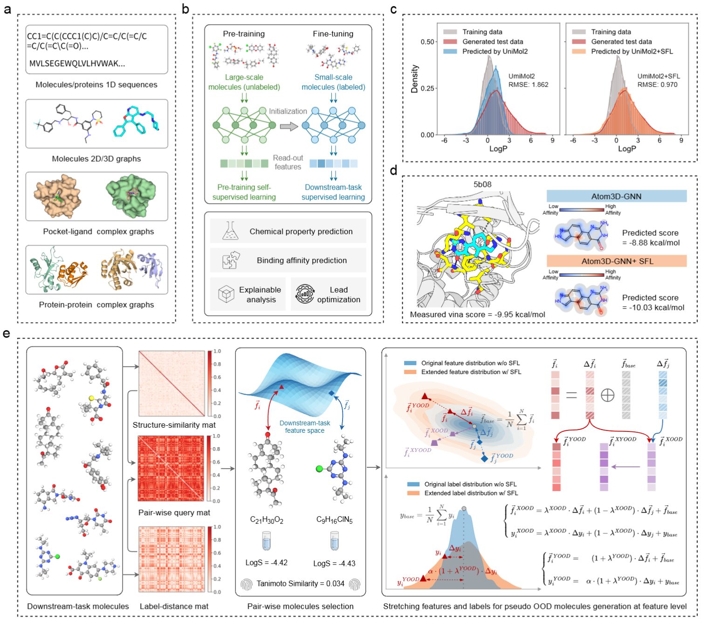

# Stretching chemical boundaries for robust out-of-distribution molecular representation learning

## Introduction
Despite recent advances achieved by pretraining, existing molecular learning methods still struggle to generalize beyond the boundaries of the training distribution. Recent efforts to address this challenge have primarily focused on developing invariant or equivariant representations, or on applying input-level data augmentation to expand molecular contexts. However, several unresolved issues remain:

1. Invariant and equivariant models are typically architecture-specific and struggle to generalize across tasks. Their limitations are particularly evident in the presence of activity cliffs, where structurally similar compounds exhibit divergent behaviors.

2.  Common data augmentation methods, such as atom masking, bond deletion, or subgraph removal, frequently compromise chemical validity. Moreover, assigning reliable property labels to such augmented molecules is inherently difficult due to complex physicochemical constraints.

3. A largely unaddressed issue is the limited extrapolation ability of current models to molecular properties beyond the training range. This significantly impedes the identification of compounds with novel pharmacological effects.

To address these challenges, we introduce Stretching Features and Labels (SFL), a general-purpose and architecture-agnostic training strategy designed to improve generalization under both structural and property distribution shifts. SFL is designed to overcome these limitations by expanding the coverage of the training distribution in a semantically coherent manner. Rather than manipulating molecular inputs directly, SFL performs extrapolation in the latent feature space. By generating pseudo–out-of-distribution samples through semantic extrapolation of molecular embeddings, and proportionally adjusting the associated property labels, SFL broadens both structural and property coverage. This augmentation strategy avoids compromising chemical validity and allows for consistent label assignment. SFL integrates seamlessly into existing pipelines for graph-based, transformer-based, and other architectures, with minimal computational overhead.

## Milestone

2025-08 ✨ **Supporting Diverse Applications:**
We extended the SFL to a range of molecular machine learning tasks, including molecular property prediction, protein–ligand binding affinity estimation, and protein–protein interaction prediction. SFL also supports additional applications such as de novo molecular screening, lead optimization, and activity cliff prediction.

2024-12 🏆 **Championship Award**: SFL achieved first place (ranked 1st among 226 teams) in [The Second Global AI Drug Development Algorithm Competition](https://aistudio.baidu.com/competition/detail/1214/0/leaderboard)!


<!-- ## Overview -->
<!-- **Stretching Features and Labels (SFL)** is a general-purpose, architecture-agnostic training strategy designed to improve OOD generalization across molecular modeling tasks. SFL generates pseudo-OOD samples by extrapolating latent molecular representations and proportionally adjusting associated property labels along semantically meaningful directions, thereby expanding both structural and property coverage without violating chemical validity. It integrates seamlessly into existing pipelines for graph-based, transformer-based, and other architectures, with minimal computational overhead. -->
## Framework

<div style="text-align: center;">
    
</div>


## Getting Started

### Environment Setup
Create and activate Conda environment:
```bash
conda env create -f environment.yml
conda activate SFL
```

### Model Training
#### Base Models
**Molecular Property Prediction**:
```bash
python train_MP.py --use_SFL 0 --arch_type unimol --dataset esol \
                   --save_dir ./ckpt_MP/base --device cuda:0
```
*Datasets*: `esol`, `freesolv`, `lipo`, `qm7`, `qm9_homo`, `qm9_lumo`, `qm9_gap`  
*Models*: `attentive_fp`, `schnet`, `egnn`, `dimenet++`, `visnet`, `gem`, `unimol`, `unimol2_84M`

**Protein-Ligand Binding Affinity Prediction**:
```bash
python train_LBA.py --use_SFL 0 --arch_type atom3d_gnn --dataset LBA_30 \
                    --save_dir ./ckpt_LBA30/base --device cuda:0
```
*Datasets*: `LBA_30`, `LBA_60`  
*Models*: `deepdta`, `moltrans`, `atom3d_cnn3d`, `atom3d_gnn`, `comenet`, `visnet`

**Protein-Protein Interaction Prediction (PPB)**:
```bash
python train_PPB.py --use_SFL 0 --arch_type dg_model --dataset PPB \
                    --save_dir ./ckpt_PPB/base --device cuda:0
```
*Datasets*: `PPB`  
*Models*: `dg_model`

#### Models with SFL
**Molecular Property Prediction**:
```bash
python train_MP_SFL.py --use_SFL 1 --arch_type unimol --dataset esol \
                       --save_dir ./ckpt_MP/SFL --device cuda:0
```

**Protein-Ligand Binding Affinity Prediction**:
```bash
python train_LBA_SFL.py --use_SFL 1 --arch_type atom3d_gnn --dataset LBA_30 \
                        --save_dir ./ckpt_LBA30/SFL --device cuda:0
```

**Protein-Protein Interaction Prediction**:
```bash
python train_PPB_SFL.py --use_SFL 1 --arch_type dg_model --dataset PPB \
                        --save_dir ./ckpt_PPB/SFL --device cuda:0
```

### Key Parameters
| Parameter    | Description                                                                 |
|--------------|-----------------------------------------------------------------------------|
| `--dataset`  | Target dataset (e.g., `esol`, `LBA_30`, `PPB`)                             |
| `--save_dir` | Output directory for model checkpoints                                      |
| `--device`   | Training device (`cuda:0`, `cpu`, etc.)                                     |
| `--use_SFL`  | Enable SFL strategy (`0` = base model, `1` = SFL-enhanced)                 |
| `--arch_type`| Model architecture (see dataset-specific options above)                    |

### Evaluation Metrics
All models report:
- **RMSE** (Root Mean Square Error)
- **MAE** (Mean Absolute Error)
- **R²** (Coefficient of Determination)

SFL-enhanced models additionally provide separate **in-distribution (ID)** and **out-of-distribution (OOD)** evaluations.


## Citation
Our paper is under review, if you find our code helpful, please cite 

```bibtex
@misc{SFL2025,
title ={Stretching chemical boundaries for robust out-of-distribution molecular representation learning},
author = {Qu, Sanqing and Zhang, Xudong and  Lu, Fan and Tang, Ruohui and Sun, Jianfeng and Wang, Jianming and Chen, 
Jieneng and Zhang, Yanping and Knoll, Alois and Gao, Shaorong and Changjun, Jiang and Chen, Guang},
year = {2025},
publisher = {GitHub},
journal = {GitHub repository},
howpublished = {\url{https://github.com/ispc-lab/SFL}},
}
```